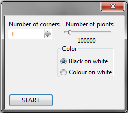
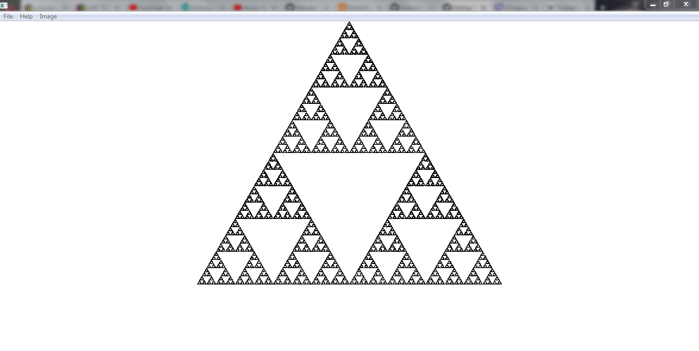
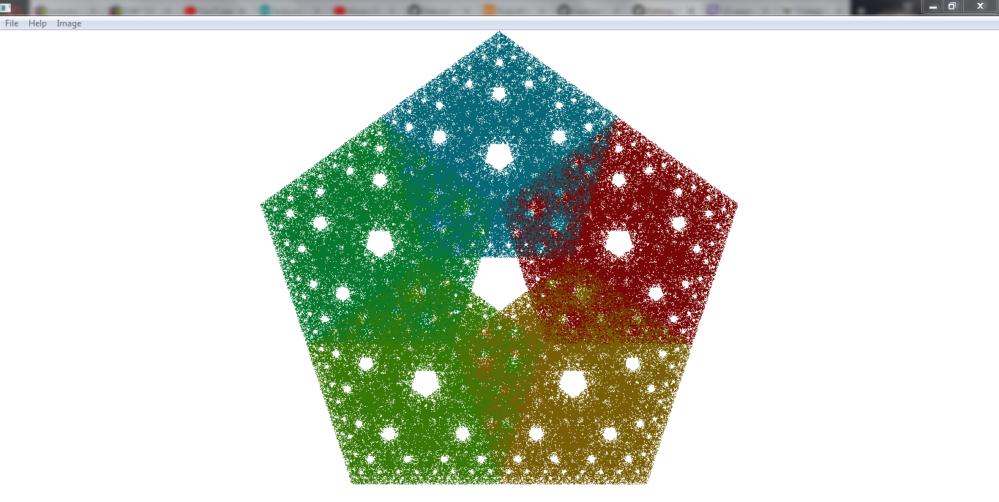

# Fractal_gen
Ten program najpierw powstał w scratch'u, ale postanowiłem przenieść go do C++,  
z nakladką graficzną WxWidgets. Następnie wylądował w Processingu (Java),  
a obecnie doczekał się wersji w P5.js (JavaScript).  
Wersja z C++ i JavaScripta znajdują się w tym repozytorium.  
  
Mój projekt w scratch'u:
https://scratch.mit.edu/projects/252639902/  
  
Fraktalna figura jest geneowana metodą "gry w chaos". Oto algorytm:  
1. Wyznaczane są wieszchołki figury.
2. Losowany jest dowolny punkt
3. Losowany jest jeden z wieszchołków
4. Odległość między tym wieszchołkiem a punktem  
   jest zmniejszana o połowę. (punkt się "przyciąga')
5. ^ 3.  

<h2>Wersja JavaScript:</h2>
  
 Link do działającego programu:  
 https://szymon300101.github.io/CHAOS/  

<h2>Wersja C++:  </h2>
  
 "Fractal_gen_setup.exe" to bardzo prosty  
 instalator do aplikacji graficznej.  
  
 "Fractal_gen_files.zip" to wszystkie pliki projektu,  
 do ich skompilowania wymagane jest środowisko z nakładką WxWidgets.  
 Zostawiam je tutaj jakby ktoś był bardzo zainteresowany,  
 ale przede wszystkim dla siebie na przyszłość.  
  
 W programie:  SPACJA - czyszczenie ekranu  
              Ctrl+s - zapisywanie ekranu  
  
  
Menu po naciśnięciu 'SET'  
  
  
Podstawowy trójkt Sierpińskiego (3 kąty, cz. na b., 100000 punktów):
  
  
Kolorowy pięciokąt (5 kątów, kol. na b., 750000 punktów):
  
